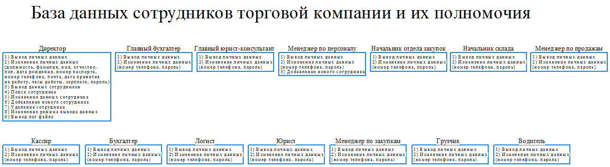
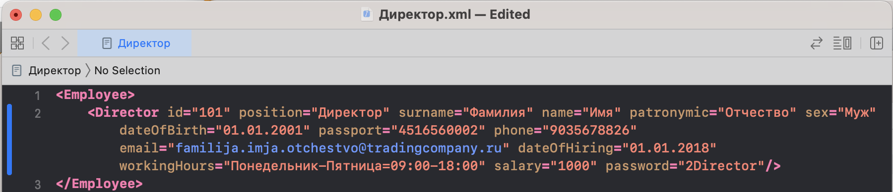
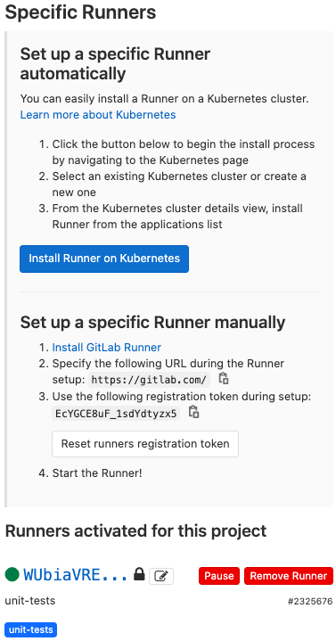
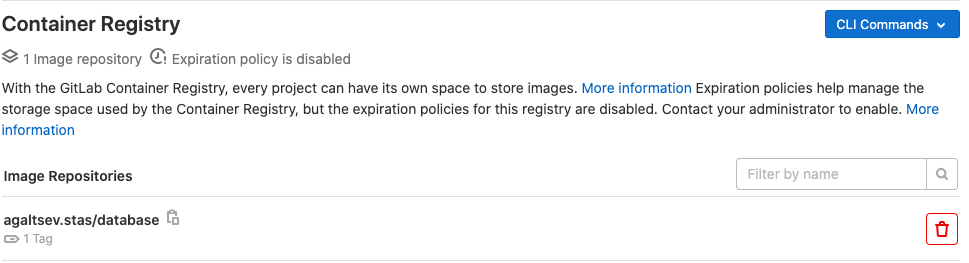
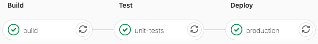
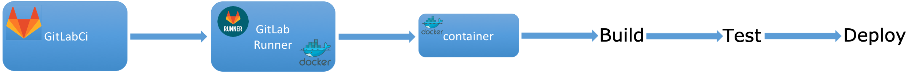

# Аннотация
Кроссплатформенный консольный проект, содержащий базу данных сотрудников торговой компании. Каждый сотрудник имеет определенную должность. У каждой должности есть свой ряд полномочий. Более подробно представлено на рисунке.
<p align="center">

</p>

## Поддерживаемые платформы
* Linux 
  * Среда разработки Qt Creator
* macOS
  * Среда разработки Xcode

## Требования:
* cmake
* qt5-qmake
* boost (не ниже версии 1.56)

## Загрузка, установка и запуск
Установку можно выполнить 2 способами:
* cmake
* qmake

### Загрузка
```
git clone https://gitlab.com/agaltsev.stas/database.git
cd database
```
### Установка с помощью cmake
```
cmake CMakeLists.txt
make
```
### Установка с помощью qmake
```
qmake database.pro
make
```
### Запуск
```
cd bin/
./database --directory=data/
```

## Запуск юнит-тестов
Запуск можно выполнить 2 способами:
* cmake
* qmake
```
cd tests/UtilsTest/
```
### Установка с помощью cmake
```
cmake CMakeLists.txt
make
```
### Установка с помощью qmake
```
qmake database.pro
make
```
### Запуск
```
cd ../../bin/tests/
./UtilsTest
```

# Описание
Запуск осуществляется командой:
```
./database --directory=<path>
```
```<path>``` - путь к базе данных. Пример входа в программу привиден на рисунке.
<p align="center">

</p>

Данные каждой должности находится в отдельном файле. Пример файла хранения данных c должностью "Директор".
<p align="center">

</p>

## Используемые паттерны:
* Фабрика объектов
* Фасад
* Декоратор
* Синглтон

# Continuous Integration — CI (интеграция с разными системами)

## Runner
GitLab Runner — это агент, который используется для запуска определенных задач (jobs), их выполнения и отправки результатов обратно в GitLab. занимается выполнением инструкций из специального файла .gitlab-ci.yml.

Задачи совершенно различными способами: локально, в docker-контейнерах, в различных облаках или через ssh-коннект к какому либо серверу.
<p align="center">

</p>

## Container registry
Container Registry — это безопасный приватный реестр для хранения образов (images) Docker. При помощи GitLab Container Registry можно использовать готовые Docker-образы для GitLab CI (интеграция с разными системами).
<p align="center">

</p>

## Pipeline
<p align="center">

</p>

## CI
<p align="center">

</p>