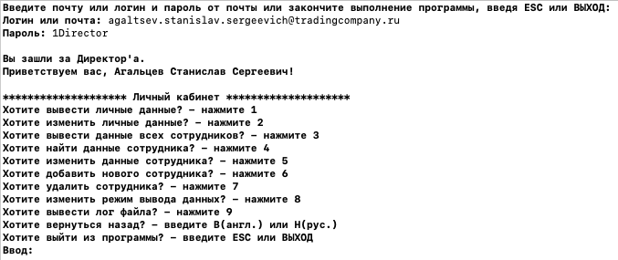

# Аннотация
Кроссплатформенный консольный проект, содержащий базу данных сотрудников торговой компании. Каждый сотрудник имеет определенную должность. У каждой должности есть свой ряд полномочий. Более подробно представлено на рисунке.
<p align="center">

</p>


## Поддерживаемые платформы
* Linux 
  * Среда разработки Qt Creator
* macOS
  * Среда разработки Xcode

## Требования:
* C++20
* cmake
* qt5-qmake
* boost (не ниже версии 1.56)

## Загрузка, установка и запуск
Установку можно выполнить 2 способами:
* cmake
* qmake

### Загрузка
```
git clone https://gitlab.com/agaltsev.stas/database.git
cd database
```
### Установка с помощью cmake
```
cmake CMakeLists.txt
make
```
### Установка с помощью qmake
```
qmake database.pro
make
```
### Запуск
```
cd bin/
./database --directory=data/
```

## Запуск юнит-тестов
Запуск можно выполнить 2 способами:
* cmake
* qmake
```
cd tests/UtilsTest/
```
### Установка с помощью cmake
```
cmake CMakeLists.txt
make
```
### Установка с помощью qmake
```
qmake database.pro
make
```
### Запуск
```
cd ../../bin/tests/
./UtilsTest
```

# Описание
Запуск осуществляется командой:
```
./database --directory=<path>
```
```<path>``` - путь к базе данных. Пример входа в программу привиден на рисунке.
<p align="center">

</p>

Данные каждой должности находится в отдельном файле. Пример файла хранения данных c должностью "Директор".
<p align="center">

</p>


# Continuous Integration — CI (интеграция с разными системами)
CI позволяет командам самостоятельно создавать, тестировать и выпускать программное обеспечение с большей скоростью, посредством встроенных средств.

## Runner
Runner — это агент, который используется для запуска определенных задач (jobs), их выполнения и отправки результатов обратно в GitLab. Задачи описаны в специальном файле .gitlab-ci.yml. 
<p align="center">

</p>

## Container Registry
Container Registry — это безопасный приватный реестр для хранения images (образов) docker. При помощи Runner можно использовать готовые docker-образы для CI.
<p align="center">

</p>

## Pipeline
Pipeline - это последовательность выполнения stages (стадий), каждая из которых включает jobs (задачи). От момента внесения изменений в код до выхода в production (производство) приложение по очереди проходит все этапы — подобному тому, как это происходит на конвейере.
<p align="center">

</p>

Краткие пояснения по стадиям:
* Build — сборка приложения
* Test — юнит-тесты
* Deploy - развёртывание на production

## Общая работа CI
<p align="center">

</p>


# Возможные ошибки в Qt Creator
### 1. Проблема с std::thread:
*Ошибка:*
>sysdeps/unix/sysv/linux/x86_64/clone.S crashing with SIGSTOP at (disassembled) "test %rax,%rax"

Callstack
```
1 clone clone.S         78  0x7f28abaef215 
2 ??    allocatestack.c 313 0x7f28abbc94b0 
3 ??                        0x7f28ab881640 
4 ??                                       
```

Disassembler for allocatestack.c stopped at:
```
pthread_create.c:
0x7f28abbc94b0                  f3 0f 1e fa                    endbr64
```

Disassembler for clone.S stopped at "test %rax,%rax":
```
        50 [1]  in ../sysdeps/unix/sysv/linux/x86_64/clone.S
0x7f2f163891e0                  f3 0f 1e fa           endbr64
        52 [1]  in ../sysdeps/unix/sysv/linux/x86_64/clone.S
0x7f2f163891e4  <+    4>        48 c7 c0 ea ff ff ff  mov    $0xffffffffffffffea,%rax
        53 [1]  in ../sysdeps/unix/sysv/linux/x86_64/clone.S
0x7f2f163891eb  <+   11>        48 85 ff              test   %rdi,%rdi
        54 [1]  in ../sysdeps/unix/sysv/linux/x86_64/clone.S
0x7f2f163891ee  <+   14>        74 3d                 je     0x7f2f1638922d <clone+77>
        55 [1]  in ../sysdeps/unix/sysv/linux/x86_64/clone.S
0x7f2f163891f0  <+   16>        48 85 f6              test   %rsi,%rsi
        56 [1]  in ../sysdeps/unix/sysv/linux/x86_64/clone.S
0x7f2f163891f3  <+   19>        74 38                 je     0x7f2f1638922d <clone+77>
        59 [1]  in ../sysdeps/unix/sysv/linux/x86_64/clone.S
0x7f2f163891f5  <+   21>        48 83 ee 10           sub    $0x10,%rsi
        60 [1]  in ../sysdeps/unix/sysv/linux/x86_64/clone.S
0x7f2f163891f9  <+   25>        48 89 4e 08           mov    %rcx,0x8(%rsi)
        64 [1]  in ../sysdeps/unix/sysv/linux/x86_64/clone.S
0x7f2f163891fd  <+   29>        48 89 3e              mov    %rdi,(%rsi)
        67 [1]  in ../sysdeps/unix/sysv/linux/x86_64/clone.S
0x7f2f16389200  <+   32>        48 89 d7              mov    %rdx,%rdi
        68 [1]  in ../sysdeps/unix/sysv/linux/x86_64/clone.S
0x7f2f16389203  <+   35>        4c 89 c2              mov    %r8,%rdx
        69 [1]  in ../sysdeps/unix/sysv/linux/x86_64/clone.S
0x7f2f16389206  <+   38>        4d 89 c8              mov    %r9,%r8
        70 [1]  in ../sysdeps/unix/sysv/linux/x86_64/clone.S
0x7f2f16389209  <+   41>        4c 8b 54 24 08        mov    0x8(%rsp),%r10
        71 [1]  in ../sysdeps/unix/sysv/linux/x86_64/clone.S
0x7f2f1638920e  <+   46>        b8 38 00 00 00        mov    $0x38,%eax
        76 [1]  in ../sysdeps/unix/sysv/linux/x86_64/clone.S
0x7f2f16389213  <+   51>        0f 05                 syscall
        78 [1]  in ../sysdeps/unix/sysv/linux/x86_64/clone.S
0x7f2f16389215  <+   53>        48 85 c0              test   %rax,%rax
```

*Решение:*
>Открыть "Параметры->Отладчик->Переменные и выражения". Добавить в поле "Настройка помощников отладчика":
```
handle SIGSTOP pass nostop noprint
```
<p align="center">

</p>

### 2. Множественные ошибки:
*Ошибки:*
>database/src/TradingCompany.cpp:5: ошибка: unknown type name 'TradingCompany'

>database/src/TradingCompany.cpp:5: ошибка: use of undeclared identifier 'TradingCompany'

*Решение:*
>Открыть "Справка->О модулях->С++". Убрать галочку с поля "ClangCodeModel. Перезагрузить Qt Creator:
<p align="center">

</p>
